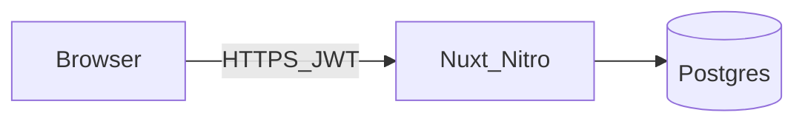

# Architecture (stub)

> **Status**: Placeholder — expand after the Nuxt blueprint scaffold exists.  
> **Related**: [Master roadmap](plans/master-roadmap.md), [Extensibility](plans/extensibility-nuxt-layers-and-hooks.md)

## Intended contents

- Trust boundaries (browser, Nitro, Postgres, S3, Mailgun).
- Request path for authenticated record APIs.
- How **Nuxt Layers** compose the app vs **runtime hook** extensibility on the server.

## Diagram (placeholder)

The following will be replaced with a C4-style or container diagram once services and modules are fixed:

