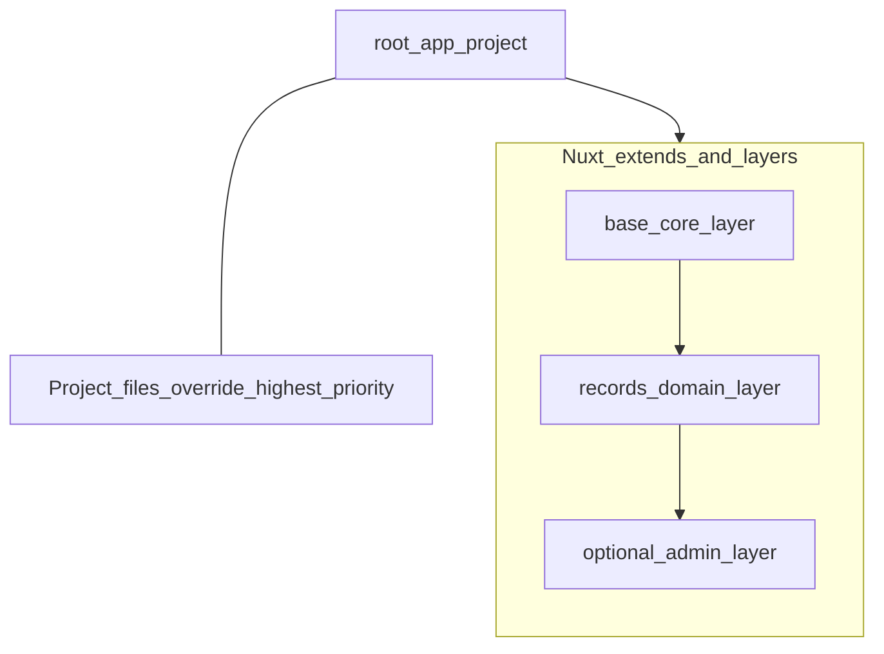
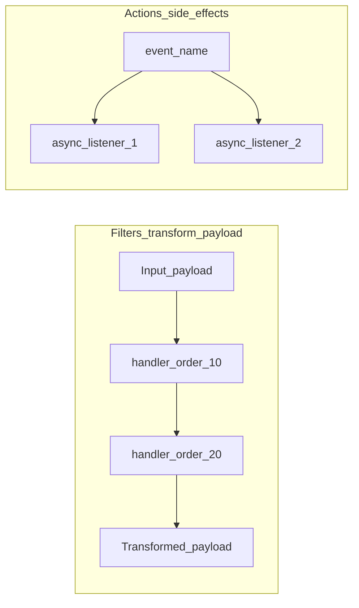

# Extensibility — Nuxt Layers, runtime hooks, and “plugins” v1

This document aligns expectations for **extending Disciple Tools v2** compared to WordPress themes/plugins. It complements the phased roadmap ([master-roadmap](./master-roadmap.md)) — **implementation is intentionally deferred** until after concrete ADRs exist in [`../adr/`](../adr/).

## Why this matters

WordPress excels at:

- Loading **many independently authored plugins** into one runtime ([hooks](https://developer.wordpress.org/plugins/hooks/) — filters change data and return it; actions run side effects).
- **Organic extension** via PHP filters/actions at known choke points (`dt_custom_fields_settings`, etc. in DT v1).

A Nuxt/Vue + Nitro stack is different: most code is **bundled** at build time. We need **two complementary strategies**:

1. **Build-time composition** — [Nuxt Layers](https://nuxt.com/docs/getting-started/layers) and packages (npm / monorepo / git `extends`).
2. **Runtime extension** — an explicit **hook registry** (and optional plugin manifests) for server (and selective client) code paths.

Your intuition that “Nuxt Layers = WordPress plugins” is **partially right** and **partially not**:

| Concern | WordPress plugin | Nuxt Layer |
|--------|------------------|------------|
| When code is wired in | Runtime (DB + PHP autoload) | **Build / dev server** — merged into the app graph |
| Who ships the code | Upload zip or `wp-content/plugins` | **npm package**, **git repo**, or local `extends` path |
| Override UI/routes | Hooks + template hierarchy | Layer **priority** / app overrides project files ([layer priority](https://nuxt.com/docs/getting-started/layers#layer-priority)) |
| Cross-cutting server logic | `add_filter` / `add_action` | **Not built-in** — implement a **Hookable**-style API (see below) |

For **first-party** or **partner** features distributed as versioned packages, **Layers are an excellent fit** — same idea as [domain-driven layer folders](https://davestewart.co.uk/blog/nuxt-layers/) (blog, admin shell, “records” domain).

For **true third-party “drop in an extension after deploy”** like WordPress, Layers alone are **insufficient**; you need a **runtime plugin model** (dynamic imports, worker isolation, signing, allowlists) — treat as a **later ADR**.

---

## Visual: where Layers fit (build-time)

Layers stack **before** the running server serves traffic; the diagram is about **merge order**, not a request lifecycle.

Reference: [Nuxt — Layers](https://nuxt.com/docs/getting-started/layers) (official), [Dave Stewart — modular site architecture](https://davestewart.co.uk/blog/nuxt-layers/) (patterns).

---

## Visual: runtime “filters vs actions” (server)

WordPress distinguishes:

- **Filters** — receive value, **return transformed value** ([filters overview](https://developer.wordpress.org/plugins/hooks/#actions-vs-filters)).
- **Actions** — fire at a point, **side effects**, no return to caller.

For Nitro/API code, replicate that split explicitly:

- **Implementation direction** (when coding later): `@unjs/hookable` is the pattern behind **Nuxt/Nitro** internals — use a typed `Hookable` instance for namespaces like `records`, `listing`, `auth`. “Filters” = ordered sequence transforming a `{ data }` context; “actions” = `parallel` emits with typed payloads.

Nuxt/Vue itself exposes **lifecycle hooks** and **nitro.hooks** — useful for infrastructure, **not** a full replacement for arbitrary domain filters across your business logic unless you consolidate your own registry.

---

## Recommended direction (planning — not coded yet)

1. **Use Layers for** packaged DT features (`layers/records`, `layers/integrations-xyz`), shared themes, and optional UI domains — aligns with blueprint + monorepo growth.
2. **Define a stable server hook catalogue** mirroring DT v1 *concepts*: e.g. `record:beforeCreate`, `record:afterRead`, `fieldSchema:combine`, `list:postQuery`. Document names and payloads in Phase 2–3 playbooks.
3. **Do not promise WordPress uploads** until an ADR covers **sandboxing**, **signing**, and **DB-backed activation** (`docs/adr/README.md`).
4. **Client-side** “hooks” — prefer Vue/Nuxt idioms (**composables**, **provide/inject**, optional **mitt** listener bus) **only where appropriate**; most parity with WP filters belongs on the **server** so permissions and payloads stay truthful.

---

## Phase mapping (documentation only)

| Phase | Extensibility notes |
|-------|---------------------|
| 1 | Consider early `layers/` layout; optional `extends` from internal packages later. |
| 2 | Introduce hook points on record/schema lifecycle **after** hook ADR drafted. |
| 3 | List pipeline hooks (`beforeQuery`, `afterResults`) optional. |
| 4 | UI extension via layers + small client registries where safe. |
| 5 | Map v1 `apply_filters(`…`)` call sites → v2 hook names for migration tooling. |

---

## Diagram conventions

For further docs, reuse [Mermaid](https://mermaid.js.org): sequence diagrams for “request hits Nitro → auth → hooks → handler”, and layer diagrams for merges. Prefer short node IDs (`recordCreate`, `listQuery`) without spaces.
