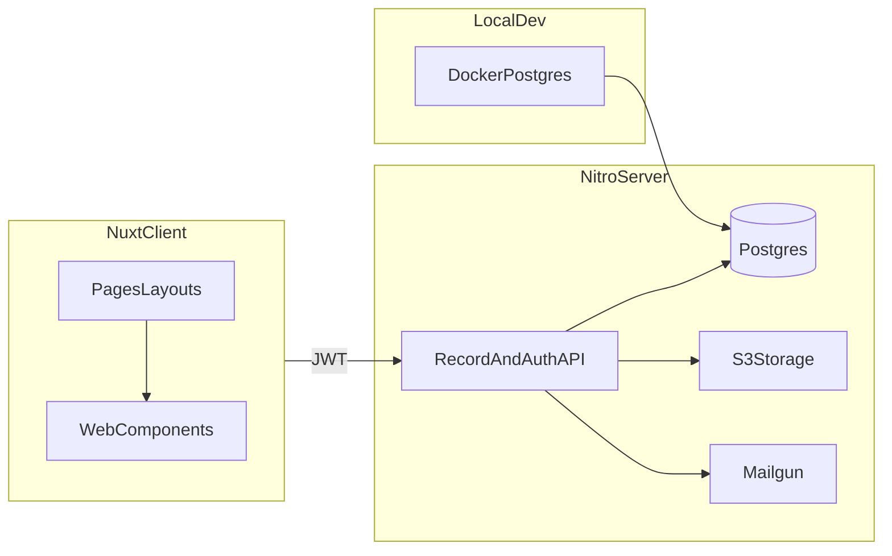

# Disciple Tools v2 — Master implementation roadmap

This document expands the phased plan for rebuilding Disciple.Tools as a **[Nuxt](https://nuxt.com)** application, using **[nuxt-blueprints](https://github.com/corsacca/nuxt-blueprints)** as the scaffold baseline, backed by **greenfield** APIs and PostgreSQL.

**Plan tracker location**: All top-level delivery plans live under [`docs/plans/`](./README.md).

---

## Decisions locked in

These choices drive the rest of the roadmap (update this section if direction changes).

| Area | Decision |
|------|----------|
| UI framework | Nuxt (Vue), full-stack with Nitro server as provided by blueprints |
| Scaffold | [nuxt-blueprints](https://github.com/corsacca/nuxt-blueprints): **JWT auth**, **Mailgun** email, **S3** storage |
| Optional blueprint blocks | **kitchen-sink**, **admin**, **user-management** |
| Data / API | **Greenfield** Postgres + application APIs in the Nuxt/Nitro stack; WordPress / `dt-posts` is **not** the runtime backend for v2 at the start |
| Migration | WordPress migration and v1 REST parity work land in a **late phase** after the v2 record model is stable |
| v1 reference | [disciple-tools-theme](https://github.com/DiscipleTools/disciple-tools-theme) — concepts: `DT_Posts`, `dt-posts/v2` REST, `dt_custom_fields_settings`, modular list + detail UI driven by `post_settings` |
| Local database | Docker Compose under [`docker/postgresql/`](../../docker/postgresql/); persist data in **`docker/postgresql/data/`** (see [Local PostgreSQL (Docker)](./local-postgresql-docker.md)) |
| Extensibility strategy | **[Nuxt Layers](https://nuxt.com/docs/getting-started/layers)** + domain packages for **build-time** composition; **typed runtime hook registry** (filters/transform + actions/events) on Nitro for **WordPress-hooks-like** extension — planned in [Extensibility: layers and hooks](./extensibility-nuxt-layers-and-hooks.md); formalize in **`docs/adr/`** before implementation |

---

## Diagrams

Use **[Mermaid](https://mermaid.js.org)** in Markdown wherever flows or layer stacks clarify reasoning (architecture, hook pipelines, request paths). Guidelines: stable node IDs (`snake_case` or `camelCase`), avoid reserved subgraph IDs, follow [official syntax notes](https://mermaid.js.org).

---

## Product capabilities to converge with v1

The first v2 waves should **design toward** these v1 behaviors (exact API shape may differ).

1. **Core and custom record types** — Equivalent to registered post types and plugin-defined types (`dt_registered_post_types` mental model).
2. **Listing** — Strong per-type listing; plus a **unified / cross-type** list or query surface where the product requires “all records” or mixed-type views (v1 today is largely per-type via `list_posts(post_type, query)`).
3. **Record detail** — Config-driven layout: **fields**, **tiles**, **sections**, and rendering with **[@disciple.tools/web-components](https://github.com/DiscipleTools/disciple-tools-web-components)** (Lit), with careful Nuxt SSR boundaries (client islands / `ClientOnly` as needed).

---

## Documentation map (repo)

| Path | Role |
|------|------|
| [`docs/README.md`](../README.md) | Contributor index; diagrams convention (Mermaid) |
| [`docs/architecture.md`](../architecture.md) | System context (stub → expand post-scaffold) |
| [`docs/plans/README.md`](./README.md) | Index of roadmap / deep-dive plans |
| [`docs/plans/master-roadmap.md`](./master-roadmap.md) | **This file** — phases, scope, risks |
| [`docs/plans/local-postgresql-docker.md`](./local-postgresql-docker.md) | Docker Postgres design and ops |
| [`docs/plans/extensibility-nuxt-layers-and-hooks.md`](./extensibility-nuxt-layers-and-hooks.md) | Layers + WordPress-style hooks strategy |
| [`docs/phases/`](../phases/README.md) | Phase playbooks (stubs → expand during execution) |
| [`docs/adr/`](../adr/README.md) | ADR index + [`0000-template.md`](../adr/0000-template.md) |

---

## Architecture snapshot (greenfield)

Local dev may run Postgres via [docker/postgresql](../../docker/postgresql/); staging/production typically use managed Postgres.

---

## Phase 0 — Plan, parity matrix, local dev baseline

**Outcomes**

- Glossary shared across docs: record type, field schema, tile, section, filter DSL.
- **Parity matrix** (table): v1 operations and payloads vs planned v2 routes (e.g. `get_post_types`, `get_post_settings`, `get_post`, `list_posts`, create/update).
- Observability and environments agreed at a high level (where logs go, staging secrets).
- **Local Postgres**: `docker/postgresql/` committed; developers can run `docker compose up` and point `DATABASE_URL` at it (see [local-postgresql-docker](./local-postgresql-docker.md)).

**Docs**

- Expand `docs/phases/phase-00-constraints-and-decisions.md` when execution starts (non-goals, NFRs, security baseline from blueprints).

---

## Phase 1 — Scaffold and platform (Nuxt blueprints)

**Outcomes**

- New Nuxt app from blueprints with **JWT**, **Mailgun**, **S3**, **kitchen-sink**, **admin**, **user-management**.
- Lint, test, and build pipelines; root `.env.example` aligned with blueprint requirements.
- **Wire `DATABASE_URL`** to local Docker Postgres (document in app README).
- Deployment story sketched (Node hosting + managed Postgres in non-dev).

**Notes**

- **Kitchen-sink**: keep as a reference for UI patterns while building Phase 4 field rendering.
- **Admin / user-management**: avoid duplicating “record admin” until Phase 2 defines the domain; document boundaries so blueprint admin does not fight a future record-type admin UI.
- **Layers**: favor a clear `layers/` or `extends` layout for packaged domains ([Nuxt Layers](https://nuxt.com/docs/getting-started/layers), [Dave Stewart](https://davestewart.co.uk/blog/nuxt-layers/)); see [Extensibility](./extensibility-nuxt-layers-and-hooks.md).

---

## Phase 2 — Domain model: core + custom record types

**Outcomes**

- **Record type registry**: system vs tenant-defined types; migrations; optional admin UI hooks.
- **Field schema**: stored model analogous to v1 `dt_custom_fields_settings` — field kinds (text, key_select, connection, date, location, etc.) using v1 docs as a **compatibility checklist**, not a copy of WordPress internals.
- **Record storage** chosen and recorded in an **ADR** (e.g. polymorphic `records` + side tables / JSONB vs partially normalized tables for hot paths).
- **Runtime hooks** catalogue (names + payload types) drafted for parity with WP `apply_filters` / `do_action` patterns — finalized by ADR before code; detail in [Extensibility](./extensibility-nuxt-layers-and-hooks.md).
- **Authorization**: scope by record type and role, inspired by v1 `DT_Posts` permission patterns; enforce on server, not only in UI.

---

## Phase 3 — Listing and queries

**Outcomes**

- **Per-type list API** — same mental model as `DT_Posts::list_posts(post_type, query)` with pagination, sort, and filters.
- **Cross-type listing** — unified endpoint or query pattern (e.g. `types[]`, discriminated `recordType` in rows). Decide via ADR:
  - Postgres-only (views, union, indexing), and/or
  - Dedicated search service (e.g. Meilisearch/OpenSearch) if full-text and cross-type filters dominate.
- **Filter contract** documented as JSON (map v1 list-query concepts from `dt-posts-list-query.md`).
- **Optional hooks** (`beforeQuery` / `afterResults` or equivalents) documented when the runtime registry lands — [Extensibility](./extensibility-nuxt-layers-and-hooks.md).

## Phase 4 — Record detail: tiles, sections, web components

**Outcomes**

- API returns a **post_settings-like** payload: fields, **tiles**, section order, display/edit flags — enough for a data-driven Nuxt page (v1 reference: `dt-assets/js/details.js`).
- **Field renderer** maps schema `type` → Lit components (`dt-text`, `dt-tags`, etc.); handles `change` → PATCH; loading / error / saved states per field standards in the web-components repo.
- Extensibility path for custom field types (plugins) without forking core renderers.

---

## Phase 5 — Migration and v1 parity hardening

**Outcomes**

- Import/export or ETL from WordPress as needed; id mapping; optional reconciliation tooling.
- Contract tests comparing sample v1 REST payloads to v2 responses for critical flows.
- Decide **API key compatibility** (same field keys as v1 vs clean break) before writing migration code.
- Maintain **v1 ↔ v2 parity mapping** (REST, filters, actions) in the Phase 5 playbook [Parity appendix](../phases/phase-05-migration-and-parity.md#parity-appendix).

## Risks and mitigations

| Risk | Mitigation |
|------|------------|
| Flexible schema hurts reporting and list performance | ADR on storage; index strategy; materialize hot fields if needed |
| Lit + Nuxt SSR mismatches | Prefer client registration or islands; document patterns in Phase 4 playbook |
| Blueprint admin overlaps custom record admin | Explicit ownership in Phase 1 docs; one “source of truth” for record CRUD |
| WP-style “upload a plugin” UX before security ADR | Prefer **Layers + server hook registry** first; dynamic third-party code only after sandboxing/signing ADR |
| Local DB sprawl | Single documented Compose path; gitignore `data/`; reset procedure in [docker README](../../docker/postgresql/README.md) |

---

## Explicitly deferred

- Final Postgres table layout (decide in Phase 2 with prototypes).
- Whether v1 REST field keys remain byte-identical (decide in Phase 5 before migration implementation).
- **Trust model for arbitrary runtime extensions** (allowlists, signing, isolation vs WordPress uploads).

---

## References

- [Nuxt — Layers](https://nuxt.com/docs/getting-started/layers)
- [Dave Stewart — Modular site architecture with Nuxt layers](https://davestewart.co.uk/blog/nuxt-layers/)
- [Mermaid](https://mermaid.js.org)
- [WordPress hooks — actions vs filters](https://developer.wordpress.org/plugins/hooks/)
- [Nuxt](https://nuxt.com)
- [nuxt-blueprints](https://github.com/corsacca/nuxt-blueprints)
- v1 theme: [disciple-tools-theme](https://github.com/DiscipleTools/disciple-tools-theme) — e.g. `docs/dt-posts-api-reference.md`, `docs/dt-posts-list-query.md`, `docs/dt-posts-field-settings.md`
- Web components: [disciple-tools-web-components](https://github.com/DiscipleTools/disciple-tools-web-components)
