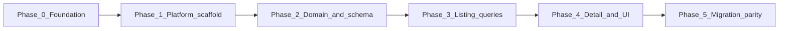
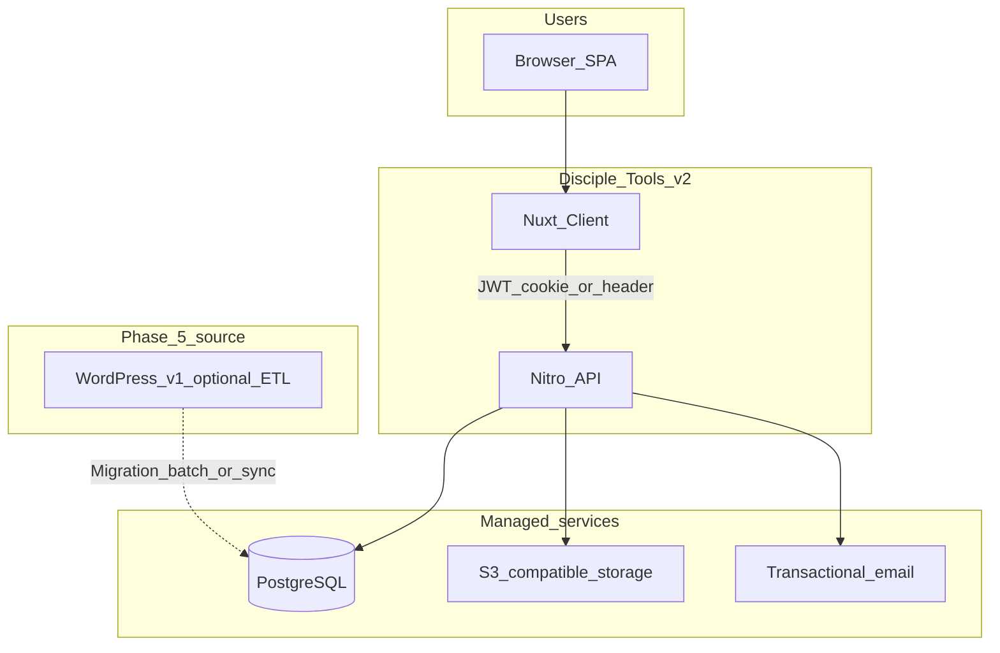
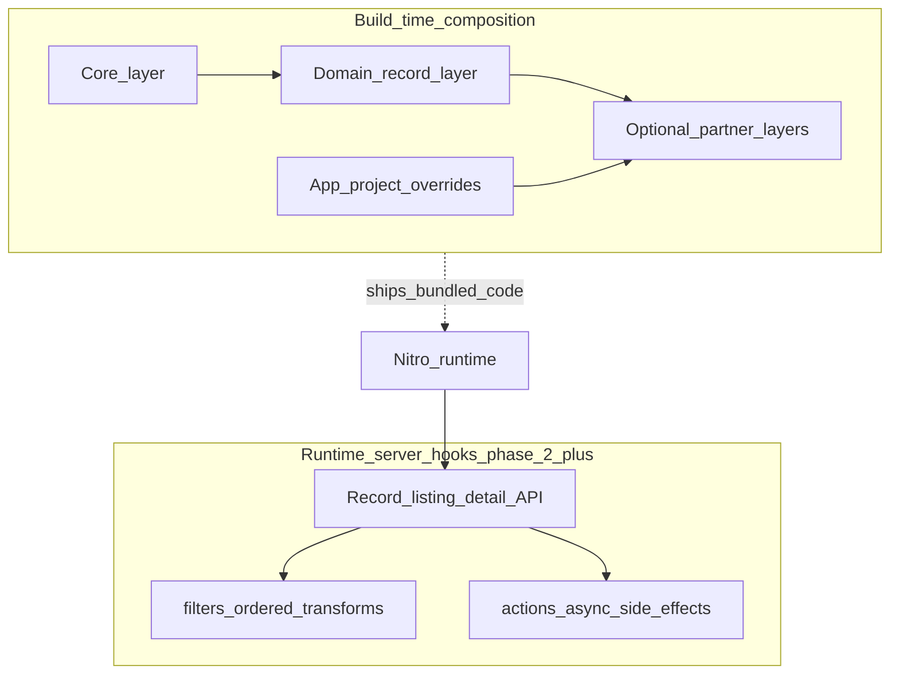

# Disciple Tools v2 — executive snapshot

**Audience**: senior management  
**Purpose**: snapshot of intent, phased roadmap, architecture direction, and delivery status  
**Generated**: 2026-05-06 (filename prefix `2605060908` = snapshot ID)  
**Authoritative detail**: [`docs/plans/master-roadmap.md`](../plans/master-roadmap.md), [`docs/phases/`](../phases/README.md)

---

## Executive summary

- **What we are building**: a new **Disciple Tools v2** web application on **Nuxt 4** (Vue), with a **greenfield PostgreSQL** data layer and APIs in the **Nitro** server — not WordPress/`dt-posts` as the primary runtime for early phases.
- **Why**: modern full-stack platform, clearer security and hosting story, and room to **design the record model deliberately** before locking migration from v1.
- **How we will deliver**: **six phases (0–5)** from planning and platform scaffold through domain model, listings, record UI, then **WordPress migration and v1 parity**.
- **Today**: **Phase 0** and **Phase 1** objectives for the current increment are **substantially met** (docs + local DB baseline + working app scaffold); **Phases 2–5** are ahead, with key decisions (storage ADR, search, API key compatibility) still to be formalized.
- **Extension strategy**: **Nuxt Layers** for build-time composition plus a planned **typed runtime hook registry** (WordPress-like filters/actions on the server) — see [`docs/plans/extensibility-nuxt-layers-and-hooks.md`](../plans/extensibility-nuxt-layers-and-hooks.md).

---

## Intent and product direction (v1 alignment)

- **Converge over time** with how v1 behaves for ministries: **core and custom record types**, strong **per-type listing**, optional **cross-type** views where the product requires them, and **record detail** driven by schema and layout metadata (tiles, sections, fields).
- **v1 remains the conceptual reference** (e.g. `DT_Posts`, list queries, field settings — see disciple-tools-theme docs); **v2 APIs may differ in shape** but should map cleanly for migration and parity testing in **Phase 5**.
- **First-user bootstrap**: no baked-in admin password — the **first registration** against an empty database becomes verified **admin** (documented in `app/README.md` and registration API).

---

## Phased roadmap (high level)

Each phase builds on the previous; later phases assume earlier contracts (auth, deployment, schema direction) are stable.

### Phase 0 — Constraints, glossary, parity framing, local dev baseline

- **Lock direction** non-goals, NFRs (accessibility, i18n hooks, performance expectations), security baseline aligned with scaffold (JWT, env handling).
- **Shared glossary** across engineering and docs: record type, field schema, tiles, sections, filter DSL.
- **Parity matrix** (conceptual → tabular): v1 REST operations and payloads vs planned v2 surfaces (`get_post`, `list_posts`, settings, etc.).
- **Local PostgreSQL**: single documented path via **`docker/postgresql/`** and `DATABASE_URL`; repeatable reset workflow for developers.
- **Statuses in docs**: phase playbook still has items to deepen; parity matrix expansion can continue **in parallel** with Phase 2.

### Phase 1 — Platform scaffold (Nuxt + blueprints)

- **Deliverable**: runnable **Nuxt app under `app/`** assembled from **[nuxt-blueprints](https://github.com/corsacca/nuxt-blueprints)** blocks: JWT auth, Mailgun email, S3 helpers, activity logging, DB rate limiting, admin shell, user management, kitchen-sink reference UI.
- **Data access**: **Kysely + Postgres**; migrations run on startup in dev when `DATABASE_URL` is set; merged schema in one place.
- **Outcome**: teams can **develop, build, and demo** auth, admin, and profile flows on local Docker Postgres; **first admin** via registration bootstrap.
- **Follow-through** (not blocking “scaffold done” for this snapshot): **CI** (lint / typecheck / build), optional **`layers/`** layout, deeper mail dev ergonomics.

### Phase 2 — Domain model: record types and field schema

- **Record type registry** (system vs tenant-defined), migrations, and server-side enforcement.
- **Field schema** model analogous in *behavior* to v1 `dt_custom_fields_settings` (field kinds as a **compatibility checklist**, not a copy of WordPress internals).
- **Storage decision** captured in an **ADR** (e.g. polymorphic `records` + JSONB vs normalized hot paths).
- **Authorization** scoped by record type and role (server-enforced, not UI-only).
- **Runtime hooks** catalogue (names, payload types) drafted and tied to the extensibility plan; finalized before wide plugin-style use.

### Phase 3 — Listing and queries

- **Per-type list API** with pagination, sort, and filters (mental model: v1 `list_posts` per type).
- **Cross-type listing** strategy (unified endpoint or query pattern); possible **ADR** if search/index service is introduced (e.g. Meilisearch/OpenSearch vs Postgres-only).
- **Filter contract** documented as structured JSON mapped from v1 list-query concepts.

### Phase 4 — Record detail: layout + web components

- API surface similar in *role* to v1 **`post_settings`**: fields, tiles, sections, display/edit metadata for a **data-driven** Nuxt detail experience.
- **Field rendering** maps schema types to **`@disciple.tools/web-components`** (Lit), with PATCH/update flows and component UX standards.
- Document **SSR/client boundaries** (e.g. client islands) to avoid Lit + SSR friction.

### Phase 5 — Migration and v1 parity hardening

- **Import/ETL** from WordPress as needed; id mapping; reconciliation tooling where required.
- **Contract tests** on sample payloads: v1 REST vs v2 for critical flows.
- **Decision before heavy migration code**: strict **API/field-key compatibility** with v1 vs controlled breaking changes — recorded and reflected in parity docs.
- **Parity appendix** maintained in [`docs/phases/phase-05-migration-and-parity.md`](../phases/phase-05-migration-and-parity.md).

---

## Roadmap sequencing (diagram)

---

## Architecture — target system context

*Local development*: Postgres often runs via **Docker Compose** at `docker/postgresql/`; production typically uses managed Postgres and the same logical architecture.

---

## Architecture — extensibility (build-time vs runtime)

- **Layers**: versioned packages / repos merged into the app graph at build time.
- **Hooks**: deliberate **typed** choke points on the server (WordPress-inspired **filters vs actions**) — detailed in [`docs/plans/extensibility-nuxt-layers-and-hooks.md`](../plans/extensibility-nuxt-layers-and-hooks.md). **Untrusted third-party “upload plugin” UX** stays explicitly deferred pending security ADRs.

---

## Current status — completed vs remaining

### Completed / substantially complete (this increment)

| Phase | Status (snapshot) |
|-------|-------------------|
| **Phase 0** | **Delivered for current needs**: documented decisions in master roadmap; local Postgres Compose path and docs; documentation tree (`docs/plans`, `docs/phases`, `docs/adr` stubs); phase playbooks seeded. **Ongoing refinement**: fuller parity matrix table and expanded Phase 0 playbook sections. |
| **Phase 1** | **Delivered — initial scaffold**: `app/` Nuxt 4 + Nuxt UI; blueprint blocks integrated (auth JWT, admin, users, email, S3, activity log, rate limit, kitchen-sink); Kysely schema + bundled migrations wiring; README quick start; **`npm run build` / typecheck** verified on the scaffold branch. **Ongoing**: CI pipeline, optional Nuxt Layers layout for domains, hardened mail dev workflow. |

### Remaining phases (not started as primary delivery)

- **Phase 2** — domain model, record types, field schema storage ADR, authz rules, hook catalogue.
- **Phase 3** — list APIs and filter contract; possible search strategy ADR.
- **Phase 4** — detail API + web-components integration patterns.
- **Phase 5** — WordPress migration, parity testing, compatibility decisions.

---

## Risks, dependencies, and known watch items

- **Upstream framework**: brief **Nuxt 4.4.x SPA dev regression** (“Vite Node IPC”) — **mitigated in repo** via `experimental.viteEnvironmentApi` in `nuxt.config.ts`; revisit when Nuxt patches land ([nuxt/nuxt#34957](https://github.com/nuxt/nuxt/issues/34957)).
- **Technical debt / documentation**: Phase 0 playbook file still labeled stub for some checklist items — **does not block** Phase 2 start but should stay on the documentation backlog.
- **Decisions that gate scale of work**: **record storage ADR** (Phase 2); **cross-type search** (Phase 3); **v1 field-key compatibility** (Phase 5).
- **Execution risk**: **Lit + Nuxt SSR** — Phase 4 must follow agreed client-only or island patterns to avoid rework.
- **Blueprint vs product**: blueprint **admin** is for **users/roles**, not record-type admin — avoid duplicating “record CRUD admin” until Phase 2 defines ownership (called out in master roadmap risks).

---

## How we will report going forward

- **Location**: `docs/reports/`
- **Naming**: `YYMMDDHHMM-<short-descriptive-name>.md` (UTC-agnostic local snapshot time; keep names stable for sorting and audit trail).
- **Suggested cadence**: end of each phase milestone or monthly — whichever matches governance needs.

---

## References (quick links)

| Document | Role |
|----------|------|
| [`docs/plans/master-roadmap.md`](../plans/master-roadmap.md) | Full phased plan, risks, deferred items |
| [`docs/phases/phase-01-scaffold-and-platform.md`](../phases/phase-01-scaffold-and-platform.md) | What landed in Phase 1 |
| [`docs/plans/extensibility-nuxt-layers-and-hooks.md`](../plans/extensibility-nuxt-layers-and-hooks.md) | Extension model |
| [`app/README.md`](../../app/README.md) | Developer quick start and first-user bootstrap |
